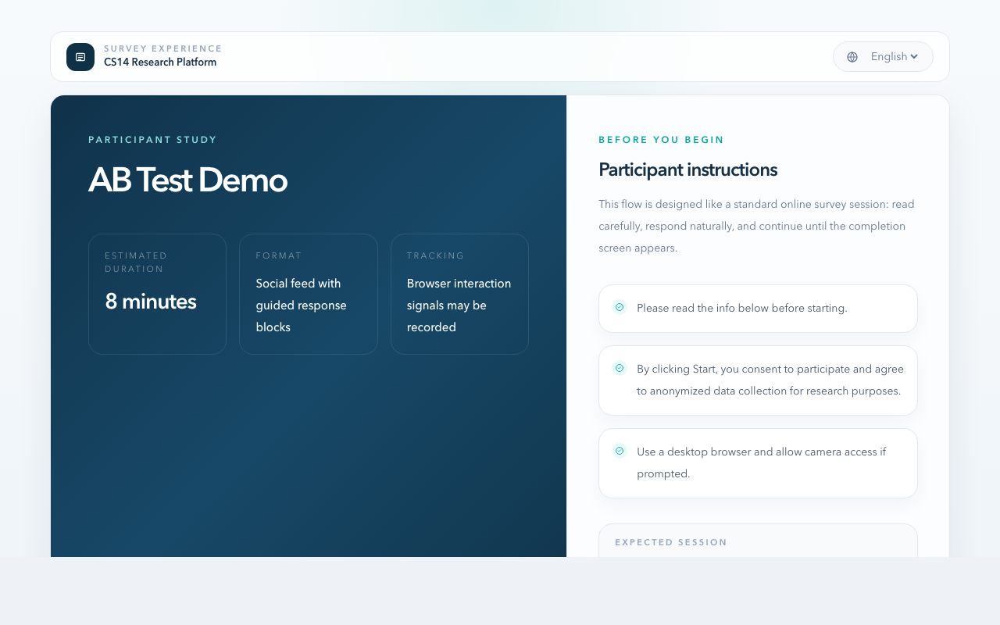
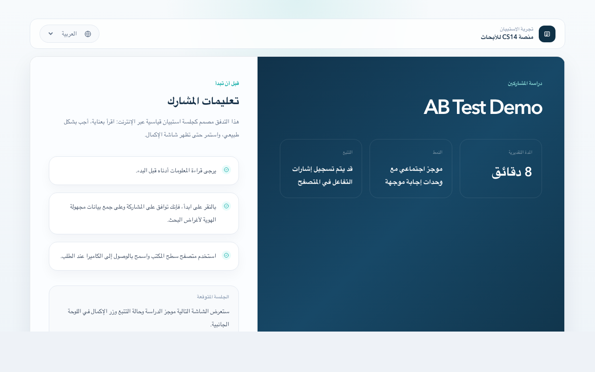
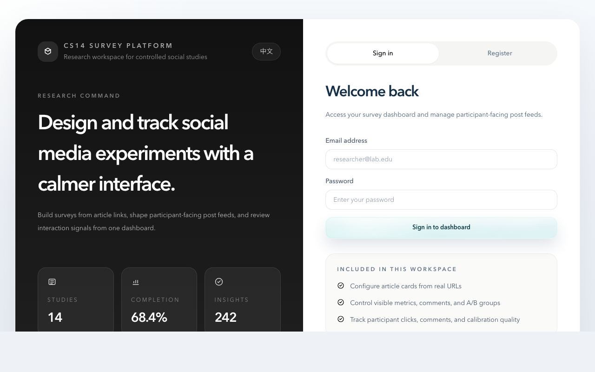
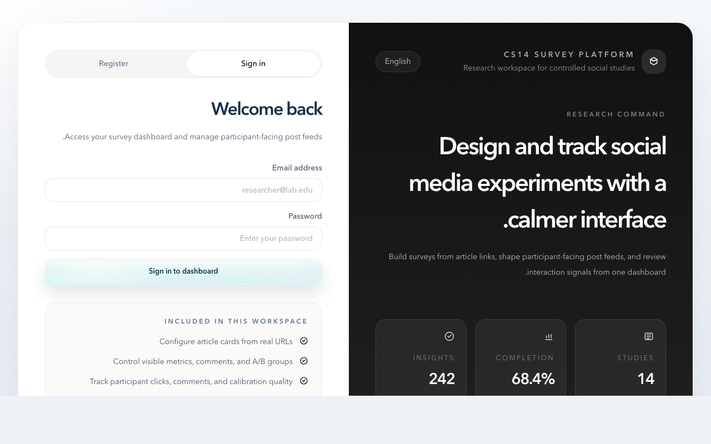

# CS14-1 · Social Media Survey Platform

> COMP5703 Capstone — University of Sydney, S1 2026

A research platform for studying how participants interact with social-media-style stimuli. Researchers paste real article URLs, the platform turns them into controllable feed posts (override headline / image / engagement counts, attach fake comments, gate by A/B group), then publishes a share link. Participants run through a guided session that records likes, comments, click positions, gaze samples, and webcam calibration quality — all anonymised under a per-session token.

<table>
  <tr>
    <td></td>
    <td></td>
  </tr>
  <tr>
    <td align="center"><sub>Participant start screen — English</sub></td>
    <td align="center"><sub>Same screen in Arabic — full RTL layout flip</sub></td>
  </tr>
</table>

## Quick start

```bash
docker compose up -d
```

| Service           | URL                         |
| ----------------- | --------------------------- |
| Frontend          | http://localhost:3000       |
| Backend API       | http://localhost:8000       |
| Swagger / OpenAPI | http://localhost:8000/docs  |
| ReDoc             | http://localhost:8000/redoc |

First run takes a few minutes (image build + `alembic upgrade head` + `npm install`). Subsequent runs are instant — both backend (`uvicorn --reload`) and frontend (`next dev`) hot-reload on file changes via bind-mounted volumes, so editing source and seeing the change in the browser doesn't need a rebuild.

To run only the database (and run backend / frontend on the host):

```bash
docker compose up db -d
cd backend && pip install -r requirements.txt && uvicorn app.main:app --reload
cd frontend && npm install && npm run dev
```

## What you get

### Researcher admin



- **Survey builder** at `/admin/surveys` — create / edit surveys, configure A/B groups, attach question blocks (`free_text` / `single_choice` / `multiple_choice` / `likert` / `rating`).
- **Post composer** — paste a real news / article URL; backend fetches Open Graph metadata (title, hero image, source). Override any field, set fake `display_likes` / `display_comments_count` / `display_shares`, attach researcher-authored fake comments, and decide which A/B groups see which posts.
- **Translations** at `/admin/surveys/{id}` — every post / comment / question block can carry per-language overrides. Bulk import / export via CSV or JSON (`GET/POST /surveys/{id}/translations`).
- **Preview** without publishing — `GET /surveys/{id}/preview` renders the participant feed for a chosen group + language so you can test before sending the share link.
- **Analytics** at `/admin/analytics` — completion rate, median session time, A/B-broken-down likes / comments / clicks, calibration pass rate, suspicious-session flags (sub-30s completion, all-empty interactions, duplicate comment text).
- **Export** — `GET /surveys/{id}/export?format=csv|json` with filters by group / language / date. Each row is keyed by an anonymous participant ID derived from the per-session token; raw tokens never leave the database.

### Participant flow

1. **Start screen** — survey title + estimated duration + consent + language picker (EN / 中文 / العربية).
2. **Webcam calibration** (when enabled on the survey) — camera permission, face-detection presence check, 9-point dot sequence using MediaPipe Face Mesh, quality score with pass / acceptable / poor verdict. See [`docs/tracking-design-decisions.md`](docs/tracking-design-decisions.md) for the scoring model.
3. **Social feed** — each post rendered with the look of a real platform card: source badge, headline, hero image, like / comment / share counters. Inline question blocks below each post for survey responses.
4. **Continuous capture** — gaze samples (1 Hz default, configurable per survey), click coordinates with `data-track` element labels (`headline` / `image` / `like_button` / `share_count`), interaction events (like, comment, share, click-through to the original article).
5. **Resume across tab close** — `participant_token` cached client-side; reopening the share link reuses the same `response_id` and A/B group, and skips calibration if it already passed. No re-randomisation, no orphan responses.
6. **Completion** — server-side timestamp diff checks for sub-30s sessions; flagged for researcher review.

### Multilingual & RTL

End-to-end multilingual support is a hard project requirement. Three locales are wired through `<html lang>` + `<html dir>` + Tailwind layouts:

| Locale | Direction | Status                                  |
| ------ | --------- | --------------------------------------- |
| `en`   | LTR       | Full UI + content                       |
| `zh`   | LTR       | Full UI + content                       |
| `ar`   | RTL       | Full UI; awaiting native-speaker review |

Switching to `ar` flips the entire layout right-to-left at first paint. An inline bootstrap script in `<head>` reads the cached locale and sets `dir` before React hydrates, so participants don't see the brief LTR flash that would otherwise show during reconciliation:



Per-survey content (post titles, comments, question blocks) is stored in dedicated `*_translations` tables and fetched on demand based on the participant's locale — researchers can ship a single survey in multiple languages from one share link.

### Calibration & tracking data model

<details>
<summary>Schema overview</summary>

- `calibration_sessions` — one per `survey_response`, status `in_progress` / `completed`, expected point count, screen + camera dimensions, model (`mediapipe_face_mesh` by default), aggregate `quality_score`, `face_detection_rate`, `stability_score`.
- `calibration_points` — one per recorded dot, `point_index` 1..N (per-survey), median iris coordinates per eye, raw sample list, per-point `valid` flag.
- `gaze_records` — `(response_id, timestamp_ms)` and `(post_id, timestamp_ms)` compound indexes for time-series queries; iris X/Y coordinates plus screen X/Y per sample.
- `click_records` — same composite indexes; `target_element` enum-ish string for heatmap categorisation.

Full contract in [`docs/tracking-api.md`](docs/tracking-api.md) and [`docs/tracking-data-flow.md`](docs/tracking-data-flow.md).

</details>

## Tech stack

| Layer    | Technology                                                    |
| -------- | ------------------------------------------------------------- |
| Frontend | Next.js 14 (App Router) · React 18 · TypeScript · Tailwind CSS |
| Backend  | FastAPI · SQLAlchemy 2.0 (async) · Pydantic v2 · Alembic      |
| Database | PostgreSQL 16                                                  |
| Tracking | MediaPipe Face Mesh (browser) · WebRTC                         |
| DevOps   | Docker Compose · GitHub Actions CI                             |

## Project layout

```
backend/
  app/
    routers/            FastAPI endpoints (auth · surveys · tracking)
    schemas/            Pydantic request / response models
    models/             SQLAlchemy ORM
    services/           OG fetcher · translation pipeline · CSV/JSON export
    utils/              Calibration quality scoring
  alembic/versions/     Schema migrations
  tests/                pytest — schema validation + router contract tests
frontend/
  app/
    admin/              Researcher dashboard + survey editor
    survey/[shareCode]/ Participant runtime (start screen + feed + calibration)
  components/           Calibration experience · locale provider · icons
  lib/                  API client · i18n dictionaries
docs/
  architecture.md                Subsystem overview
  tracking-api.md                Tracking endpoint contracts (auth, error codes)
  tracking-data-flow.md          DB schema & batch flow
  tracking-design-decisions.md   Calibration scoring rationale
```

## Module ownership

| Role             | Module                                                      |
| ---------------- | ----------------------------------------------------------- |
| Frontend A (×2)  | Researcher admin UI · survey editor · analytics             |
| Frontend B (×2)  | Participant runtime · social feed · calibration UI          |
| Backend A/B (×2) | Auth · survey/post CRUD · OG fetch · translations · export  |
| Backend C (×2)   | Calibration · gaze tracking · click tracking · Swagger docs |

## Contributing

See [`CONTRIBUTING.md`](CONTRIBUTING.md) for branch / commit / PR conventions.

```bash
# create a feature branch from dev
git checkout dev && git pull
git checkout -b feature/<module>-<short-desc>

# work, commit (conventional style), push
git push -u origin feature/<module>-<short-desc>

# open a PR to dev — CI must pass + 1 approval, squash merge
gh pr create --base dev
```

Run the backend test suite before opening a PR:

```bash
cd backend && python -m pytest -q
```

Frontend type check:

```bash
cd frontend && npx tsc --noEmit
```

## License

Coursework deliverable for COMP5703 — not licensed for redistribution.
