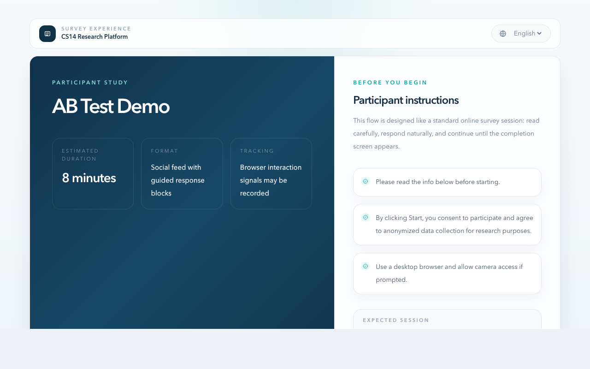
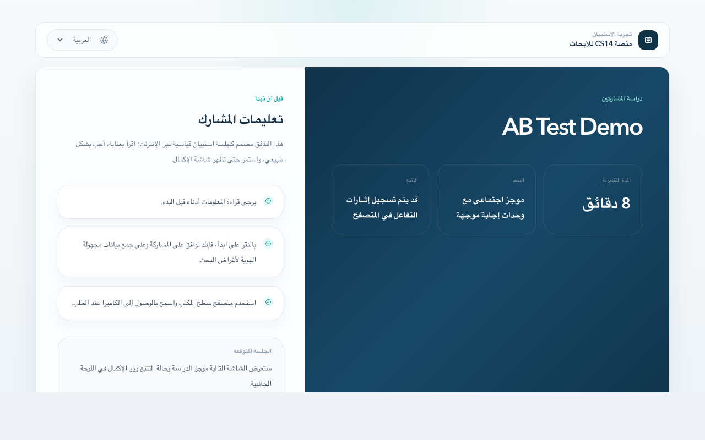
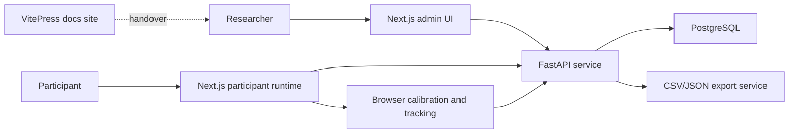

# CS14-1 Social Media Survey Platform

> COMP5703 Capstone, University of Sydney S1 2026.

CS14 is a research platform for running controlled social-media-style survey
studies. Researchers build multilingual feed experiments, publish participant
links, collect anonymous behavioural data, and export the results for analysis.

The product is designed for credibility, misinformation, and engagement-cue
experiments where a researcher needs the look and rhythm of social feeds without
sending participants into uncontrolled live platforms.

## Current Demo

| Surface | Link / command | Purpose |
| --- | --- | --- |
| Live application | <https://cs14.kazelis.top/> | Researcher admin and participant entry point |
| Public handbook | <https://cs14-docs.kazelis.top/> | Researcher workflow, deployment, privacy, export, acceptance matrix |
| OpenAPI / Swagger | <https://cs14.kazelis.top/docs> | Backend contract review |
| Main participant seed | <https://cs14.kazelis.top/survey/CS14DEMO2026?lang=en> | Calibration, feed interaction, analytics walkthrough |
| Demo runbook | [docs/DEMO_RUNBOOK.md](docs/DEMO_RUNBOOK.md) | Presenter script, share-code matrix, smoke checks |
| Public smoke test | `./scripts/verify_demo_public.sh` | Health check plus published demo share-code checks |

Researcher credentials for shared hosts are handled through the course/demo
handoff process and environment-backed seed script. Do not commit personal
passwords or production secrets to the repository.

## What The Platform Proves

- **Controlled social feeds:** paste or manually define article-like stimuli,
  override headline/image/source/counters, add scripted comments, and choose a
  platform-style presentation.
- **Experimental conditions:** assign participants to A/B groups, show different
  post variants per group, and preserve the assigned group across tab closes.
- **Participant-safe runtime:** participants use a share link, choose language,
  complete consent, optional calibration, feed tasks, and survey questions
  without a participant account.
- **Progress integrity:** required question answers must be submitted. If a
  survey has no question blocks, any recorded post interaction is enough to
  complete the run: like, participant comment, link click, or share.
- **Attention evidence:** optional webcam calibration and browser-side tracking
  produce numeric quality/gaze/click signals. Raw webcam video is not persisted.
- **Researcher exports:** analytics and CSV/JSON exports support group, language,
  completion status, calibration, and preview filters.
- **Multilingual delivery:** English and Chinese are fully supported, with Arabic
  RTL layout support for interface and smoke validation.

<table>
  <tr>
    <td></td>
    <td></td>
  </tr>
  <tr>
    <td align="center"><sub>Participant start screen - English</sub></td>
    <td align="center"><sub>Same flow in Arabic - RTL layout</sub></td>
  </tr>
</table>

## Research Workflow

| Step | Researcher action | Platform support |
| --- | --- | --- |
| 1. Design | Create a survey, languages, groups, and required question blocks | Admin survey builder and typed backend validation |
| 2. Compose | Add social-style posts from URLs or manual content | Open Graph fetcher, fallback fields, comments, counters, image override |
| 3. Preview | Check group/language rendering before publish | Preview routes that do not pollute final participant data |
| 4. Publish | Share one public participant link | Stable share codes and token-bound resume behaviour |
| 5. Run | Participant consents, calibrates if required, reads posts, answers tasks | Multilingual participant runtime, calibration UI, click/gaze batching |
| 6. Analyse | Compare groups and inspect quality flags | Analytics dashboard, suspicious-session flags, CSV/JSON export |

## Architecture


```mermaid
flowchart LR
  Researcher["Researcher"] --> Admin["Next.js admin UI"]
  Participant["Participant"] --> Runtime["Next.js participant runtime"]
  Runtime --> Calibration["Browser calibration and tracking"]
  Admin --> API["FastAPI service"]
  Runtime --> API
  Calibration --> API
  API --> Postgres["PostgreSQL"]
  API --> Export["CSV/JSON export service"]
  Docs["VitePress docs site"] -. handover .-> Researcher
```

## Tech Stack

| Layer | Technology |
| --- | --- |
| Frontend | Next.js 15, React 18, TypeScript, Tailwind CSS |
| Backend | FastAPI, SQLAlchemy 2.0 async, Pydantic v2, Alembic |
| Database | PostgreSQL 16 |
| Tracking | MediaPipe Face Mesh in-browser, WebRTC camera permission, batched click/gaze APIs |
| Docs | VitePress plus in-repo markdown runbooks |
| DevOps | Docker Compose, Caddy/Cloudflare deployment notes, shell smoke checks |

## Quick Start

Run the whole stack locally:

```bash
docker compose up -d
```

| Service | URL |
| --- | --- |
| Frontend | <http://localhost:3000> |
| Backend API | <http://localhost:8000> |
| Swagger / OpenAPI | <http://localhost:8000/docs> |
| ReDoc | <http://localhost:8000/redoc> |

First run builds images, installs frontend dependencies, applies Alembic
migrations, and starts hot-reload services. Local Compose starts with an empty
database unless you create surveys manually or run the demo seed:

```bash
docker compose exec backend python -m scripts.seed_client_demo
```

To run only Postgres in Docker and run app services on the host:

```bash
docker compose up -d db

cd backend
pip install -r requirements.txt
uvicorn app.main:app --reload

cd ../frontend
npm install
npm run dev
```

## Validation

Backend tests:

```bash
docker compose exec -T backend pytest -q
```

Frontend quality gate:

```bash
docker compose run --rm -T --no-deps frontend \
  sh -c 'npm run lint && npm run build && npm audit --audit-level=moderate'
```

Public demo smoke:

```bash
DEMO_HOST=cs14.kazelis.top ./scripts/verify_demo_public.sh
```

Docs site:

```bash
cd docs-site
npm install
npm run build
```

## Privacy And Data Boundaries

- Participant sessions are identified by anonymous per-session tokens.
- Raw participant tokens are not included in researcher exports.
- Webcam frames stay in the browser; the backend stores calibration verdicts,
  numeric gaze/click samples, and quality summaries.
- Clicks, comments, shares, and likes are recorded separately so analytics can
  distinguish each participant behaviour during review and export.
- Production deployments must set a real `SECRET_KEY`, `DEBUG=false`, and
  appropriate `CORS_ORIGINS`. The root Compose defaults are for local development
  only.

See [docs-site/docs/guide/calibration-privacy.md](docs-site/docs/guide/calibration-privacy.md)
and [docs/deployment.md](docs/deployment.md) for the full operational notes.

## Repository Map

```text
backend/
  app/
    routers/            FastAPI routes for auth, surveys, tracking, export
    schemas/            Pydantic request/response contracts
    models/             SQLAlchemy ORM models
    services/           Open Graph fetch, translations, export
    utils/              Calibration and attention quality scoring
  alembic/versions/     Database migrations
  scripts/              Demo data seed
  tests/                Pytest contract and behaviour tests

frontend/
  app/
    admin/              Researcher dashboard, survey builder, analytics
    survey/[shareCode]/ Participant start page, feed runtime, calibration flow
  components/           Calibration, gaze picture-in-picture, locale provider
  lib/                  API client, dictionaries, MediaPipe loader

docs/                   Markdown runbooks and engineering docs
docs-site/              Published VitePress handbook source
scripts/                Public smoke verifier
```

## Documentation Map

| Document | Use it for |
| --- | --- |
| [docs/README.md](docs/README.md) | Human-facing documentation index |
| [docs/DEMO_RUNBOOK.md](docs/DEMO_RUNBOOK.md) | Presenter script, seeded share codes, demo checks |
| [docs/researcher-user-guide.md](docs/researcher-user-guide.md) | Survey creation, translations, publishing, export |
| [docs/deployment.md](docs/deployment.md) | Production environment, migrations, HTTPS, CORS |
| [docs/tracking-api.md](docs/tracking-api.md) | Tracking endpoint contracts and error behaviour |
| [docs/tracking-data-flow.md](docs/tracking-data-flow.md) | Stored calibration/gaze/click data model |
| [docs/tracking-design-decisions.md](docs/tracking-design-decisions.md) | Calibration quality scoring rationale |

## Contributing

Use `dev` as the integration branch. Keep changes scoped, run the validation
commands above, and open pull requests with conventional commit-style titles.

```bash
git checkout dev
git pull
git checkout -b feature/<area>-<short-description>

# work, test, commit
git push -u origin feature/<area>-<short-description>
gh pr create --base dev
```

## License

Coursework deliverable for COMP5703. Not licensed for redistribution.
