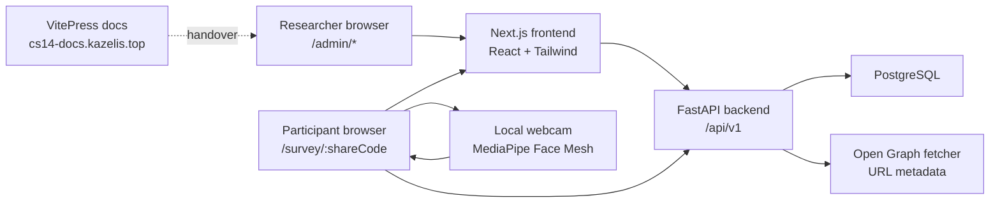
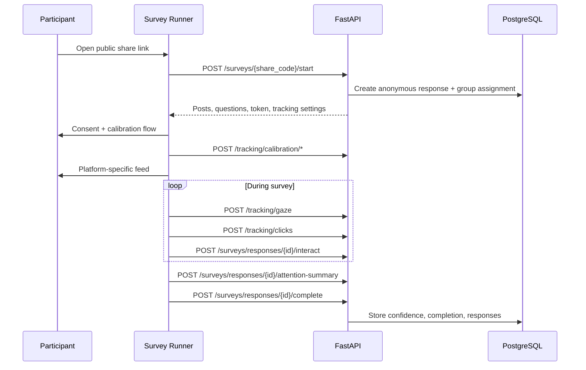

# System Architecture

CS14 is a full-stack research platform: researchers design social-media-style survey studies in the admin workspace, participants complete the study through a public share link, and the backend stores survey content, responses, calibration metadata, gaze samples, click records, and exports.

## Runtime View

## Main Modules

| Module | Responsibility | Important files |
| --- | --- | --- |
| Admin workspace | Create/edit/publish surveys, configure platform style, groups, posts, translations, preview, analytics, export. | `frontend/app/admin/*` |
| Participant runner | Consent, language selection, calibration, social feed rendering, click/gaze collection, completion. | `frontend/app/survey/[shareCode]/*` |
| Backend API | Auth, survey CRUD, public participant flow, translations, analytics, export, tracking ingestion. | `backend/app/routers/*` |
| Data model | Researcher-owned surveys, posts, questions, translations, anonymous responses, calibration and tracking records. | `backend/app/models/*` |
| Docs/runtime ops | Public documentation, demo runbook, deployment checklist, acceptance matrix. | `docs-site/docs/*`, `docs/*` |

## Participant Data Flow

## Design Choices

- **Public participant links stay anonymous.** The participant token binds updates to one response without requiring login.
- **Researcher operations require auth and ownership checks.** Analytics, exports, translations, and survey editing are not public.
- **Platform style is a research variable.** `platform_ui_style` controls the participant visual treatment while `platform_style` remains a legacy compatibility field.
- **Camera data is minimized.** The browser uses webcam frames locally for MediaPipe detection, but the backend stores numeric calibration/gaze records and confidence summaries, not raw video.
- **Exports are research-first.** CSV/JSON include response metadata, group/language filters, calibration status, attention confidence, interactions, gaze, and click evidence.

