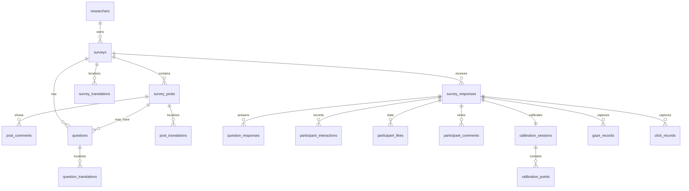

# Database Design

PostgreSQL is the source of truth. The schema separates researcher-authored study content from anonymous participant data, and separates displayed fake engagement numbers from participant interactions.

## Entity Relationship Overview

## Core Tables

| Table | Purpose | Key fields |
| --- | --- | --- |
| `researchers` | Admin users. | `email`, `password_hash`, `name` |
| `surveys` | Study definition and runtime settings. | `status`, `share_code`, `platform_ui_style`, `default_language`, `supported_languages`, `num_groups`, `gaze_tracking_enabled`, `calibration_enabled` |
| `survey_posts` | Researcher-authored social post cards. | `original_url`, fetched OG fields, display overrides, `source_label`, fake likes/comments/shares, group visibility/overrides |
| `post_comments` | Fake comments shown inside the post stimulus. | `author_name`, `text`, `order` |
| `questions` | Survey-level or post-attached questions. | `question_type`, `text`, `config`, `order` |
| `survey_translations`, `post_translations`, `question_translations` | Localized copy for multilingual studies. | `language_code`, `translated_fields` |

## Participant Tables

| Table | Purpose | Key fields |
| --- | --- | --- |
| `survey_responses` | One anonymous participant session. | `participant_token`, `assigned_group`, `language`, `status`, `started_at`, `completed_at`, `attention_confidence`, `attention_quality` |
| `question_responses` | Answers to configured questions. | `answer_text`, `answer_value`, `answer_choices` |
| `participant_interactions` | Event stream for like/comment/share/click-style actions. | `action_type`, `post_id`, optional `comment_text`, optional coordinates |
| `participant_likes` | Current like state for toggles. | unique `(response_id, post_id)` |
| `participant_comments` | Participant-authored comments. | `text`, `author_name`, timestamps |
| `calibration_sessions` | Result of the pre-survey webcam calibration. | `passed`, `quality`, `quality_score`, `face_detection_rate`, `validation_error_px` |
| `calibration_points` | Samples for each calibration target point. | `target_screen_x`, `target_screen_y`, `samples`, medians |
| `gaze_records` | Survey-time gaze samples. | `post_id`, `timestamp_ms`, `screen_x`, `screen_y`, iris coordinates |
| `click_records` | Survey-time click samples. | `post_id`, `timestamp_ms`, `screen_x`, `screen_y`, `target_element` |

## Why This Shape

- Survey content is editable and researcher-owned; response data is append-style and anonymous.
- The fake engagement numbers shown to participants live on `survey_posts`; actual participant behavior lives in participant tables.
- Translations are JSON field maps so the admin can export/import CSV/JSON without a new column for every copy field.
- Attention confidence is stored on `survey_responses` so CSV/JSON exports can filter or down-weight lower-quality responses without recomputing every gaze sample.
